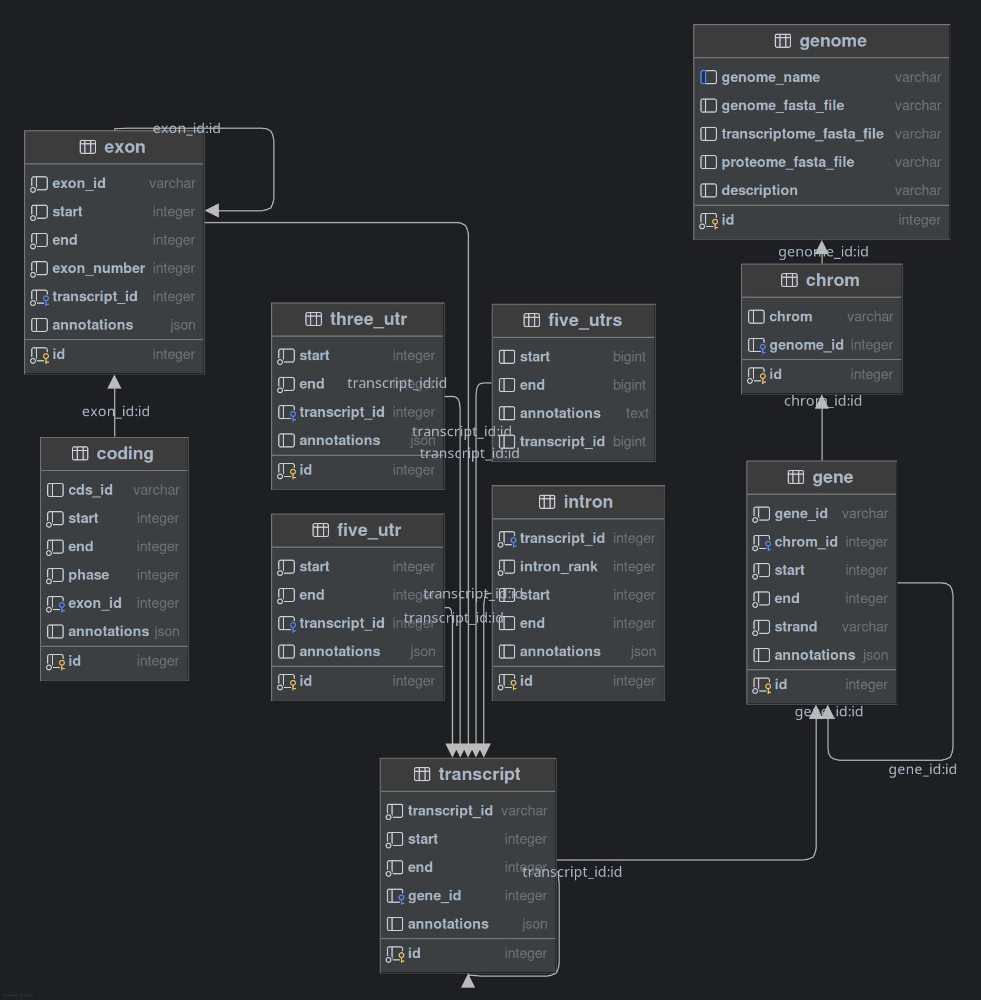

# Genome Module

A module for working with genomic data, providing functionality to query and manipulate genome sequences, annotations, and features through a database interface.

## Overview

The `Genome` class provides methods to:
- Load and query genomic sequences from FASTA files
- Query genomic features (genes, transcripts, exons, CDS regions, introns) 
- Generate transcriptome and proteome sequences
- Retrieve genomic sequences for specific regions

## Usage

### Initializing a Genome Object

The below code initializes a `Genome` class instance, if the database connection already has a genome with that name it will just return the connection, if not
it will create a new genome. This will happen if the database does not have genome with the same name, if there are multiple genomes (you can store as many genomes as you want) with 
the same name, it will return a value error since we do not have way of knowing which one to use.

```python
from benchmate.genome.genome import Genome

# Create a genome object with required files
genome = Genome(
    genome_fasta="path/to/genome.fa",
    transcriptome_fasta="path/to/transcriptome.fa",  # Optional
    proteome_fasta="path/to/proteome.fa",            # Optional
    db_conn=engine,                                  # SQLAlchemy engine
    taxon_id="9606"                                 # Optional taxonomy ID
)
```

### Querying Genomic Features

The module supports querying different types of genomic features:

```python
from benchmate.ranges.genomicranges import GenomicRange

# Query genes by ID
genes = genome.genes(ids=["ENSG00000139618"])

# Query genes in a specific region
region = GenomicRange("chr1", 1000000, 2000000, "+")
genes_in_region = genome.genes(range=region)

# Get transcripts for a gene
transcripts = genome.transcripts(gene_id="ENSG00000139618")

# Get exons for a transcript
exons = genome.exons(transcript_id="ENST00000380152")

# Get coding sequences
cds = genome.coding(transcript_id="ENST00000380152")

# Get introns
introns = genome.introns(transcript_id="ENST00000380152")
```

### Retrieving Sequences

If you have provided a transcriptome or proteome FASTA file, you can retrieve sequences directly by setting the type to "transcriptome" or "proteome" respectively.
If you have not you will get an error saying something about `None` types since these features are set to `None` by default. 

```python
# Get sequence for a specific genomic range
gr = GenomicRange("chr1", 1000000, 1001000, "+")
sequence = genome.get_sequence(gr)
```

### Adding arbitrary annotations:

You can add arbitrary annotations to the genome object, the annotation will have to be structured in a way that is compatible 
with the database schema. To ensure this compatibility, you will need to specify the "table". This can be one of the following:

- "gene"
- "transcript"
- "exon"
- "cds"
- "intron"
- "three_utr" and "five_utr"

Additionally, you will need to specify the row id so we know which feature we need to add the annotation to. These can be obtained
by querying the database using one of the methods mentioned above. The row id is returned in the "annot" section of the `GenomicsRanges`
instance with the `db_id` key. If there are additional annotations with within the GTF file you used, these will be in there too. 

If they dictionary key you used to add annotation is already there you will get a value error instead of overwriting the existing annotation.
This is on purpose since there may be multiple annotations or multiple connections to the database trying to get the same value. 

```python
genome.add_annotation("gene", 100, {"function": "my_annotation"})
```

## Database Schema

The module uses the following database tables:



## Notes:

- All genomic coordinates are 1-based and inclusive
- The database schema uses SQLAlchemy for ORM
- FASTA files are accessed using pysam
- Strand can be either '+', '-' or '*' for unstranded things like breaks. 
- Multiple genomes can be stored at the same time. 
- There is no requirement to use the knowledgebase to store your genome, you can use
any database connection that can be used with `SQLAlchemy`. 

