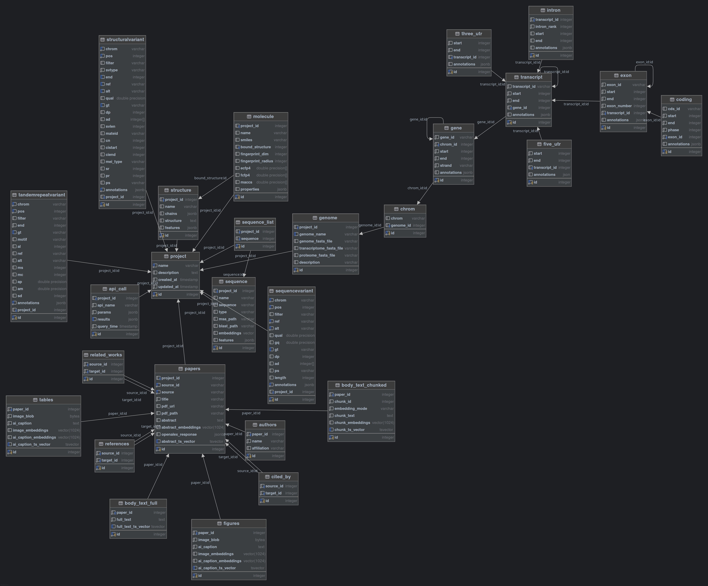

# Knowledge Base Module

The knowledge base as the name suggests is there for storing information. This is a posgresql database with tables orgnized
in a way that makes it easy to search for information. This is especially true for the Paper class instances and API calls. 

Usually, the end user will not really interact with the database, but will use the project [meta-class](project.md) to search
for different things. 

Below is the database schema:

There are a lot of modalities represented in the database, and some of them are split into several different tables. 

All of the tables are centered around the project table where each different item refers to a project. 
One thing that is not ideal in this schema is if, for example, you have the same paper for different projects, you will need 
to save it twice. 

In future iterations we will try to make the schema more normalized and make it easier to search for different things across
projects. 

## Notes:

This project is still under heavy development. The tables and the schemas may change and new tables might be added with 
additional modalities. Please see [contributing](contributing.md) for more information about how to add your own and 
contribute to the project. 